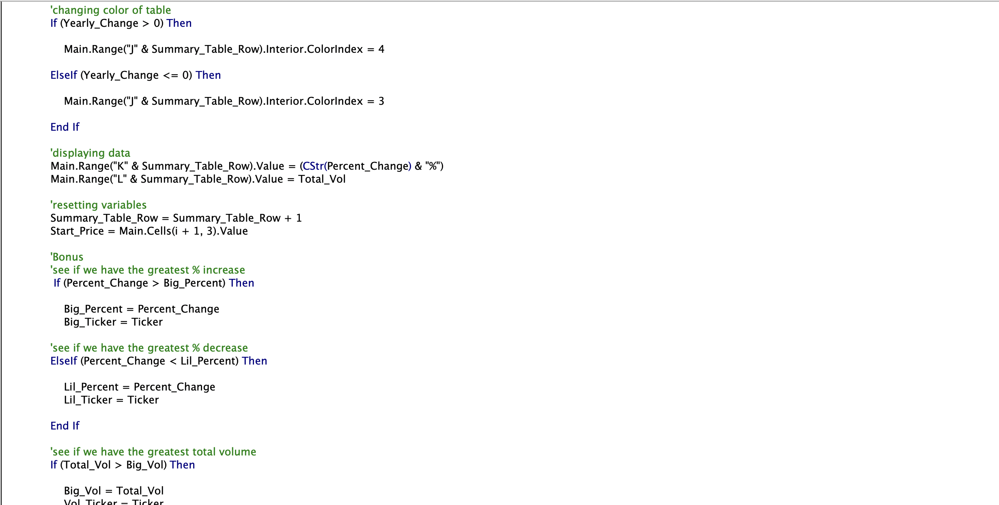

# VBA_challenge

## Overview of Project

 Create a script that loops through all the stocks for each year and outputs the following information on each sheet in the WorkBook:

  * The ticker symbol.

  * Yearly change from opening price at the beginning of a given year to the closing price at the end of that year.

  * The percent change from opening price at the beginning of a given year to the closing price at the end of that year.

  * The total stock volume of the stock.

  * Add functionality to your script to return the stock with the "Greatest % increase", "Greatest % decrease", and "Greatest total volume".

### Purpose

I am using VBA scripting to analyze generated stock market data in order to analys the extensive amount of data provided.

## Analysis and Challenges

### Data 2018

### Data 2019

### Data 2020

### Analysis of Outcomes Based on Goals

* During this assignment I was able to complete all the goals and objectives for the assignment. I used trouble shooting the code as I went and making sure I was fully understanding what each part of my code did, so when an error poped up I knew how to approach the problem.

### Challenges and Difficulties Encountered

* I think the biggest challenge for me was figuring out how to display the headers and using the code to find what the last row was in the various sheets.

### Code Part 1

### Code Part 2

### Code Part 3

### Code Part 4

## Results

* What are two conclusions you can draw about the data?

    * All the greatest percent increase, greatest percent decrease and greatest total volume were from tickers in the second half of the alphabet. 

    * The range of the data was also changing from year to year.
        
        * 2018 had the smallest range of data
        * 2019 had the largest range of data

* What are some limitations of this dataset?

    * What was happening in the world outside of the data that could have effected the data?